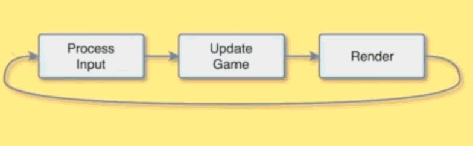
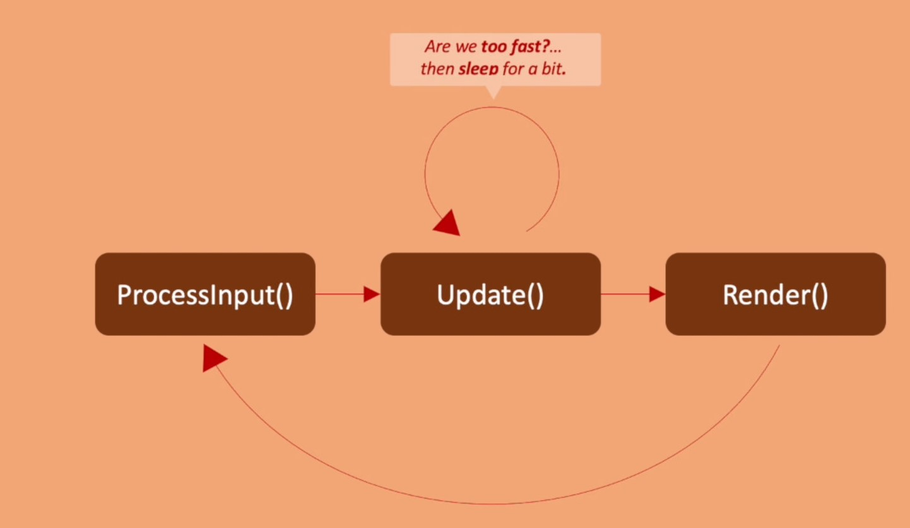

# Objective
- Game Loop


# Learn

<!--Start Accordion -->
<details>
  <summary>Titile</summary>

# Subtitle

</details>
<!--End Accordion -->

<!--Start Accordion -->
<details>
  <summary>Game Loop</summary>

# Objective 
- What is Game Loop
- 3.14

# What is a game loop
- Game Loop is Infinite Loop (usually target as 60 Frame Per Second)
- - Process Input
- - Update Game
- - Render
- 

# Tips
- Game class is respnsible for game loop 
- Use double buffering for rendering process

# Code
- Initialize(){} => Window, Renderer from SDL

# SDL Functions
- SDL_CreateWindow(title, x, y, width, height, flag for some style)
- SDL_CreateRenderer(window, index of monitor, 0) 
- - -1 = default
- - 0 = nothing
- SDL_RenderClear for buffering renderer with front/back buffer
</details>
<!--End Accordion -->

<!--Start Accordion -->
<details>
  <summary>Intro to Memory Allocation</summary>

# Objective
- Heap & Stack
- 3.15, 3.16

# Heap
- new keyword is for heap allocation => ex: <code>Game *game = new Game();</code>
- Need to use pointer with heap if you want to use bigger object for much more memory.
- you need to deallocate the memory for heap => ex: <code>delete game;</code>

# Stack
- Limited memory usage from OS, usually few MBs => Ex: <code>Game game;</code>)
- Access with "." => Ex: <code>game.Initialize(WINDOW_WIDTH, WINDOW_HEIGHT);</code>
- Don't have to deallocate the object

</details>
<!--End Accordion -->


<!--Start Accordion -->
<details>
  <summary>Detail about Stack & Heap</summary>

# Stack
- In the stack, the allocation happens on contiguous blocks of memory
- The size of memory to be allocated is known to the compiler
- The stack has a fixed size (OS-dependent)
- We don't have to worry about memory allocation/deallocation of stack variables
 
 ## Code Example
```cpp
void SomeFunction() {
    // Creates an object in the stack
    Enemy enemy;

    enemy.Jump();
    enemy.Run(20);
    enemy.LookLeft();
} // Scope ends, object is automatically destroyed
```

# Heap
- In the heap, memory is allocated dynamically and it's usually not contiguous
- The heap has no fixed-size restrictions, but heap handling is slower than stack handling
- The programmer is responsible for remembering to deallocate the object in memory

## Code Example
```cpp
void SomeFunction() {
    // Creates an object in the heap using the "new" keyword
    Enemy* enemy = new Enemy();

    enemy->Jump();
    enemy->Run(20);
    enemy->LookLeft();

    // We need to explicitly "delete" the object
    delete enemy;
} 
```


</details>
<!--End Accordion -->


<!--Start Accordion -->
<details>
  <summary>New & Delete</summary>

# Objective
- Learn more about new & delete
- 3.17

# What is happening inside new & delete?
- new => Memory allocation (malloc) & Initialization (constructor)
- delete => Deinitialization (destructor) & Deallocation (free)

# The new keyword will:
- allocate (malloc) the necessary memory for the object
- initialize (call the appropriate constructor) for that object

# The delete keyword will
- deinitialize the object by calling the destructor
- deallocate (free) the memory resources allocated by the object

## Code Example
```cpp
void SomeFunction() {
    // Creates an object in the heap using the "new" keyword
    Enemy* enemy = new Enemy();

    enemy->Jump();
    enemy->Run(20);
    enemy->LookLeft();

    // We need to explicitly "delete" the object
    delete enemy;
} 
```

# Pointers
## Raw Pointers 

### Code Example
```cpp
void Run() {
    Enemy* e = new Enemy;

    // Here we can use the object

    delete e;
}
```

## Smart Pointers
- Modern C++ uses smart pointers to help programmers with the issue of having to remember to manually destroy objects.

### Code Example
```cpp
// We will not learn about smart pointers in this introductory course
```

</details>
<!--End Accordion -->


<!--Start Accordion -->
<details>
  <summary>Timestep</summary>

# Objective
- Understand delay & DeltaTime Method
- 3.18
- 
# DeltaTime
- DeltaTime is the amount elapsed since the last frame.
- We don't think how many pixels per frame... but instead we think how many pixels per second.

## Code Example
```cpp
// difference in ticks from last frame converted to seconds
float deltaTime = (SDL_GetTicks() - ticksLastFrame) / 1000.0f;

// ...
// ...
// ...

// the projectile will move 20 pixels per second
projectile.position.x += 20 * deltaTime; // performance is different from machine to machine
```

# If you implement DeltaTime,
- Now our game objects will move correctly regardless of the frame rate.
- As a rule, all objects in the scene should be updated as a function of delta time.

</details>


<!--End Accordion -->


<!--Start Accordion -->
<details>
  <summary>Implementation of DeltaTime Method</summary>

# Objective
- Learn how to implement DeltaTime
- 3.19, 3.20
- 

# Procedure
- Decide target FPS => ex: <code>const unsigned int FPS = 60;</code>
- Decide target time in milliseconds => <code>const unsigned int FRAME_TARGET_TIME = 1000 / FPS;</code>
- Implement DeltaTime Logic in Update(){}
- Be sure to take care of left-over delta time in case the process is finished too fast
- Be sure to take care of limiting delta time to certain value for avoiding to have big delta time

## Code Example
```cpp 
void Game::Update() {
    // Wait until 16ms has ellapsed since the last fram
    // Alternative method: SDL_Delay
    while (!SDL_TICKS_PASSED(SDL_GetTicks(), ticksLastFrame + FRAME_TARGET_TIME));

    // Delta time is the difference in ticks from last frame converted to seconds
    float deltaTime = (SDL_GetTicks() - ticksLastFrame) / 1000.0f;

     int ticksLastFrame = 0; // keep this variable  in Game.h

    // Clamp deltaTime to a maximum value
    deltaTime = (deltaTime > 0.05f) ? 0.05f : deltaTime;

    // Sets the new ticks for the current frame to be used in the next pass
    ticksLastFrame = SDL_GetTicks();

    projectilePosX += projectileVelX * deltaTime;
    projectilePosY += projectileVelY * deltaTime;

}
```


- 
## Code Example 

</details>
<!--End Accordion -->


<!--Start Accordion -->
<details>
  <summary>SDL_Delay</summary>

# Obejctive
- Learn while loop
- 3.21, 3.22

# Disadvantage of while loop 
- In the real world, you shouldn't use while loop because while loop is processor instruction.
- Once we compile program, while loop becomes a part of executable. 
- When OS is executing the task, it doesn't know what to do.
- Processor could burn in some case (Might waste resources) 
- We should use SDL_Delay function

# SDL_Delay
- Proper delay function relies on OS capability of using the execution to order processes.
- SDL_Delay is operating system specific (ex: Scheduling the processes, managing the tasks)

## Code Example
```cpp
void Game::Update() {
    // Waste some time / sleep until we reach the target frame time in milliseconds
    int timeToWait = FRAME_TARGET_TIME - (SDL_GetTicks() - ticksLastFrame);

    // Only sleep if we are too fast
    if (timeToWait > 0 && timeToWait <= FRAME_TARGET_TIME) {
        SDL_Delay(timeToWait);
    }

    // Delta time is the difference in ticks from last frame converted to secomds
    float deltaTime = (SDL_GetTicks() - ticksLastFrame) / 1000.0f;

    // Clamp deltaTime to a maximum value
    deltaTime = (deltaTime > 0.05f) ? 0.05f : deltaTime;

    // Sets the new ticks for the current frame to be used in the next pass
    ticksLastFrame = SDL_GetTicks();

    // Use deltaTime to update my game objects
    projectilePosX += projectileVelX * deltaTime;
    projectilePosY += projectileVelY * deltaTime;
}
```

# Note
- SDL_Delay is not accurate enough
- It never work at a finer resolution than what the OS's scheduler offers.
- If you are looking for accuracy, then using SDL_Delay is not our best bet.
- For some game engines, they implement timerate-independent movement using only the delta time technique.
- This means the application is free to run as fast as it can (200 FPS, 300 FPS, 700FPS, etc)
- We will achieve a frame-rate independent movement
- If you want to know more about this topic click here => [Fix Your Timestep!](https://gafferongames.com/post/fix_your_timestep/)

</details>
<!--End Accordion -->


<!--Start Accordion -->
<details>
  <summary>Vector2</summary>

# Objective
- Use vector2 with glm math library

## Code Example
```cpp
#include "../lib/glm/glm.hpp"

// ..


glm::vec2 projectilePos = glm::vec2(0.0f, 0.0f);
glm::vec2 projectileVel = glm::vec2(30.0f, 45.0f);

// ..

void Game::Update() {
    // DeltaTime

    // Use deltaTime to update my game objects
    projectilePos = glm::vec2(
        projectilePos.x + projectileVel.x * deltaTime,
        projectilePos.y + projectileVel.y * deltaTime
    );
}

```

</details>
<!--End Accordion -->


